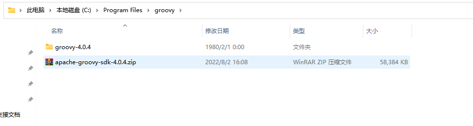
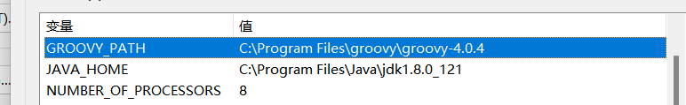
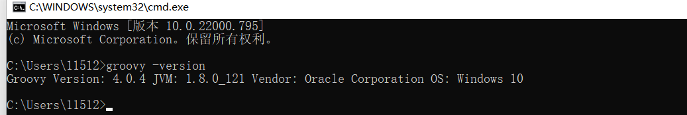

# groovy入门

## groovy简介

[Groovy](http://www.groovy-lang.org/) 是 Apache 旗下的一门基于 JVM 平台的动态/敏捷编程语言，在语言的设计上它吸纳了 Python、Ruby 等语言的优秀特性，语法非常简练和优美，开发效率也非常高。并且，Groovy 可以与 Java 语言无缝对接，在写 Groovy 的时候如果忘记了语法可以直接按Java的语法继续写，也可以在 Java 中调用 Groovy 脚本，这有效的降低了 Java 开发者学习 Groovy 的成本。Groovy 也并不会替代 Java，而是相辅相成、互补的关系，具体使用哪门语言这取决于要解决的问题和使用的场景。


##  groovy环境安装(非必须)

* 在 Groovy 官网下载压缩包 <http://www.groovy-lang.org/download.html>

* 解压到当前目录，如下图所示：

  

* 配置环境变量，跟Java一样，如下图所示




* 验证是否安装完成，cmd输入：groovy -version，出现版本等信息说明安装完成



## groovy基础语法


### 基本语法

1、Groovy注释标记和Java一样，支持 //或者/**/

2、Groovy语句可以不用分号结尾。Groovy为了尽量减少代码的输入，确实煞费苦心

3、单引号

单引号” 中的内容严格对应Java中的String，不对 $ 符号进行转义

```groovy
def s1 = '这是单引号测试'
println( s1 )
```

运行结果：

```groovy
这是单引号测试
```

4、双引号

双引号”“的内容则和脚本语言的处理有点像，如果字符中有$号的话，则它会表达式先求值。

```groovy
def name = 'liuxin'
def s2 = "$name 这是双引号测试"
println( s2 )
```

运行结果：

```
liuxin 这是双引号测试
```

5、三引号

三个引号”’xxx”’中的字符串支持随意换行 比如

```groovy

def s3 = '''这是三引号测试
a
b
c
c
'''
println(s3)
```

运行结果：

```
这是三引号测试
a
b
c
c
```

### 定义变量

Groovy中支持动态类型，即定义变量的时候可以不指定其类型。Groovy中，变量定义可以使用关键字def。注意，虽然def不是必须的，但是为了代码清晰，建议还是使用def关键字,

- 定义一个变量

```
def a = 1 //定义一个整形

def b = "字符串" //定义一个字符串

def double c = 1.0  //定义一个 double 类型，也可以指定变量类型，当指定变量类型def可以省略
```

### 定义函数

无返回类型的函数定义，必须使用def关键字 ，最后一行代码的执行结果就是本函数的返回值

```
//无参函数
def fun1(){

}

//有参函数 , 无需指定参数类型  
def fun2( def1 , def2 ){

}
```

如果指定了函数返回类型，则可不必加def关键字来定义函数

```
String fun3(){
    return "返回值"
}
```

其实，所谓的无返回类型的函数，实际上根据编译后的class文件查看，就是返回了Object。毕竟，Groovy 是基于Java 的，而且最终会转成 Java Code 运行在 JVM 上 .

Groovy的函数里，可以不使用return xxx 来设置 xxx 为函数返回值。如果不使用 return 语句的话，则函数里最后一句代码的执行结果被设置成返回值。

```
def getSomething(){  
     "返回值" //如果这是最后一行代码，则返回类型为String  
      1000  //如果这是最后一行代码，则返回类型为Integer  
}  
```

除了每行代码不用加分号外，Groovy中函数调用的时候还可以不加括号

例子1：

```
def s1 = "123"

println(s1)

//或者

println s1 
```

例子2：

```
println(fun1())

println fun1()

def fun1(){
    "你好"
}
```

效果：

```
你好
你好
```

省略圆括号虽然使得代码简洁，看起来更像脚本语言

### 循环

- 方式一

```groovy
for (i = 0; i < 5 ; i++) {
    println("测试")
}
```

1、运行结果： 

```
第0次循环
第1次循环
第2次循环
第3次循环
第4次循环
```


2、groovy 语法中，注意 i 前面不用指定 int 类型。

- 方式二(**注意：他是闭区间**)

```
for (i in 0..5){
    println("第${i}次循环")
}
```

输出

```
第0次循环
第1次循环
第2次循环
第3次循环
第4次循环
第5次循环

```


### 循环 time

times表示从0开始循环到4结束

```
4.times {
    println it
}
```

结果：

```
0
1
2
3
```


### 三目运算符

Java 语法

```groovy
def name
def result = name != null ? name : "abc"
println(result)
```

groovy 语法

```groovy
def name = ''
def result = name?: "abc"
```

### 捕获异常

捕获所有的 Exception ，有两种写法

```groovy
//第一种写法，Java 写法
try {
    println 5 / 0
} catch (Exception e) {

}

//第二种写法，Groovy 写法
try {
    println 5 / 0
} catch (anything) {

}
```

### switch

```groovy
age = 36
def rate

switch (age) {
    case 10..26:
        rate = 0.05
        break
    case 27..36:
        rate = 0.06
        break
    case 37..46:
        rate = 0.07
        break
    default:
        throw new Exception()
}

println( rate)
```

### 判断是否为真

```groovy
Person person

//Java 写法
if (person!= null){
    if (person.Data!=null){
        println person.Data.name
    }
}

//Groovy
println person?.Data?.name
```

### as

as 就是数据类型转换

```groovy
def s1 = "5"
//String 转成 int
def s2 = s1 as int

//String 转成 double
def s3 = s2 as double
```

### list

链表，其底层对应Java中的List接口，一般用ArrayList作为真正的实现类

```groovy
package com.liu.groovy


//变量定义：List变量由[]定义，其元素可以是任何对象
def aList = [5,'string',false]


println(aList)

println aList[0]  //获取第1个数据

println aList[1]  //获取第2个数据

println aList[2]  //获取第3个数据

println aList[3]  //获取第4个数据

println( "集合长度：" + aList.size())

//赋值

aList[5] = 100  //给第10个值赋值

aList<<10 //在 aList 里面添加数据

aList.add(11)
println aList

println "集合长度：" + aList.size()

```

结果：

```
[5, string, false]
5
string
false
null
集合长度：3
[5, string, false, null, null, 100, 10, 11]
集合长度：8
```


### map

键-值表，其底层对应Java中的LinkedHashMap。 


```groovy
package com.liu.groovy

def map = [key1: "value1", key2: "value2", key3: "value3"]

println map

println("数据长度：" + map.size())
println(map.keySet())
println(map.values())
println("key1的值：" + map.key1)
println("key1的值：" + map.get("key1"))


//赋值
map.put("key4", "value4")

Iterator it = map.iterator()
while (it.hasNext()) {
    println "遍历map: " + it.next()
}


map.containsKey("key1") //判断map是否包含某个key

map.containsValue("values1")  //判断map是否包含某个values


Set set = map.keySet() //把 map 的key值转换为 set

println set

map.clear()  //清除map里面的内容

println map
```


结果：

```
[key1:value1, key2:value2, key3:value3]
数据长度：3
[key1, key2, key3]
[value1, value2, value3]
key1的值：value1
key1的值：value1
遍历map: key1=value1
遍历map: key2=value2
遍历map: key3=value3
遍历map: key4=value4
[key1, key2, key3, key4]
[:]
```


### range

Range 是 Groovy 对 List 的一种拓展

```groovy
package com.liu.groovy

def range = 1..5

println(range)
//[1, 2, 3, 4, 5]

range.size()  //长度

range.iterator() //迭代器

println "获取标号为1的元素:${range.get(1) }" //获取标号为1的元素

println range.contains( 5) //是否包含元素5
println("第一个数据: "+range.from) //第一个数据
//第一个数据: 1

println("最后一个数据: "+range.to)   //最后一个数据
//最后一个数据: 5

println range.last() //最后一个元素

println range.first() //di一个元素


```


## groovy 进阶

### 闭包

是Groovy中非常重要的一个数据类型或者说一种概念了。闭包，是一种数据类型，它代表了一段可执行的代码。一个方法甚至可以将。闭包作为参数。它们是匿名的。

下面是一个简单闭包的例子，它是什么样子。

```groovy
def test1 = { println "这是一个闭包" }
test1.call()
```

在上面的例子中，代码行 { println "这是一个闭包" }被称为闭包。此标识符引用的代码块可以使用call语句执行。

当我们运行上面的程序，我们将得到以下结果 -

```
这是一个闭包
```


闭包也可以包含形式参数，以使它们更有用，就像Groovy中的方法一样。

```groovy
def test2 = { param -> println "${param} :这是一个闭包" }
test2.call("liuxin")
```

在上面的代码示例中，注意使用$ {param}，这导致closure接受一个参数。当通过clos.call语句调用闭包时，我们现在可以选择将一个参数传递给闭包。

当我们运行上面的程序，我们将得到以下结果 -

```
liuxin :这是一个闭包
```

下一个重复了前面的例子并产生相同的结果，但显示可以使用被称为它的隐式单个参数。这里的'it'是Groovy中的关键字。

```groovy
def test3 = { println "${it} :这是一个闭包" }
test3.call("张三")
```

当我们运行上面的程序，我们将得到以下结果 -

```
张三 :这是一个闭包
```

#### 闭包和变量

更正式地，闭包可以在定义闭包时引用变量。以下是如何实现这一点的示例。

```groovy
def str1 = "Hello"
def clos = { param -> println "${str1} ${param}" }
clos.call("World")

str1 = "Welcome"
clos.call("World")
```

在上面的例子中，除了向闭包传递参数之外，我们还定义了一个名为str1的变量。闭包也接受变量和参数。

当我们运行上面的程序，我们将得到以下结果 -

```
Hello World 
Welcome World
```

#### 在方法中使用闭包

闭包也可以用作方法的参数。在Groovy中，很多用于数据类型（例如列表和集合）的内置方法都有闭包作为参数类型。

以下示例显示如何将闭包作为参数传递到方法。

```groovy
def str1 = "Hello"
def clos = { param -> println "${str1} ${param}" }
def static display(clo) {
    clo.call("方法参数")
}

display(clos)
```

当我们运行上面的程序，我们将得到以下结果 

```
Hello World
Welcome World
Welcome 方法参数
```

#### 集合和字符串中的闭包

List，Map和String方法接受一个闭包作为参数。让我们看看在这些数据类型中如何使用闭包的例子。

* list在下面的例子中，我们首先定义一个简单的值列表。列表集合类型然后定义一个名为.each的函数。此函数将闭包作为参数，并将闭包应用于列表的每个元素

```groovy
def lst = [11, 12, 13, 14]
/*
public static <T> List<T> each(List<T> self, @ClosureParams(FirstParam.FirstGenericType.class) Closure closure) {
    return (List)each((Iterable)self, closure);
}*/

lst.each { println it }
```

当我们运行上面的程序，我们将得到以下结果 -

```
11 
12 
13 
14
```

* map 在下面的例子中，我们首先定义一个简单的关键值项Map。然后，映射集合类型定义一个名为.each的函数。此函数将闭包作为参数，并将闭包应用于映射的每个键值对。

```groovy
/**
 * public static <K, V> Map<K, V> each(Map<K, V> self, @ClosureParams(MapEntryOrKeyValue.class) Closure<?> closure) {
 Iterator var2 = self.entrySet().iterator();

 while(var2.hasNext()) {
 Map.Entry<K, V> entry = (Map.Entry)var2.next();
 callClosureForMapEntry(closure, entry);
 }

 return self;
 }
 */
def mp = [key1: "value1", key2: "value2", key3: "value3"]
mp.each { println it }
mp.each { println "${it.key} maps to: ${it.value}" }
```

当我们运行上面的程序，我们会得到以下结果 -

```
key1=value1
key2=value2
key3=value3
key1 maps to: value1
key2 maps to: value2
key3 maps to: value3
```

* string   在下面的例子中，我们首先定义一个简单的字符串。然后，字符串定义一个名为.each的函数。此函数将闭包作为参数，并将闭包应用于每个字符。

```groovy
def str = "这是一个测试字符串"
str.each {println(it)}
str = str.replace("一个","两个")
println str
```


* 一些常用的方法

| 方法            |                             描述                             |
| :-------------- | :----------------------------------------------------------: |
| find()          |         find方法查找集合中与某个条件匹配的第一个值。         |
| findAll（）     |           它找到接收对象中与闭合条件匹配的所有值。           |
| any() & every() | 该方法any迭代集合的每个元素，检查布尔谓词是否对至少一个元素有效。 |
| collect()       | 该方法通过集合收集迭代，使用闭包作为变换器将每个元素转换为新值。 |


### 特征

通过**trait**关键字修饰，它们可以被看作是承载默认实现和状态的接口。

我觉得，**interface**是为了实现**多态**，即，同样方法在不同类上的不同表现；**trait**是为了**单态**，即多个类，都具有同样方法的相同实现。特征间也可以通过extends关键字进行继承。使用特征的方式和接口一样，都是通过implements关键字。

因为**trait**带有默认实现，有点像虚函数，**interface**下的函数体是空的，类似抽象函数，所以，比起接口，实现特征的实体类，可以选择重写或否特征里的函数。

下面给出了一个特征的例子：

```
trait A {
    void display() {
        println("Display A")
    }
}
// 然后可以使用 implement 关键字以类似于接口的方式实现 trait。
class B implements A {
    String name
    int age

    @Override
    void display() {
        println("Display B")
    }
}

B b = new B()
b.setAge(1)
b.setName("张三")
b.display()
```

输出结果：

```
Display B
```

#### 实现接口

Traits 可以实现接口，在这种情况下，使用 interface 关键字声明接口。

下面给出了实现接口的特征的示例。在以下示例中，可以注意以下要点。

- 接口 C使用方法 displayC定义。
- 特征 A实现了 C接口，因此需要为 displayC方法提供一个实现。

```groovy
package com.liu.groovy

interface C{
    void displayC()
}

trait A implements C{
    @Override
    void displayC() {
        println("实现接口")
    }

    void display() {
        println("Display A")
    }
}

class B implements A {
    String name
    int age
}

B b = new B()
b.setAge(1)
b.setName("张三")
b.display()

```

上述程序的输出将是 -

```
Display A
实现接口
```

#### 属性

特征可以定义属性。下面给出了具有属性的trait的示例。

在以下示例中，integer 类型的 Marks1 是一个属性。

```groovy
package com.liu.groovy

interface C{
    void displayC()
}

trait A implements C{
    int age

    @Override
    void displayC() {
        println("实现接口")
    }

    void display() {
        println("Display A")
    }
}

class B implements A {
    String name
}

B b = new B()
b.setAge(16)
b.setName("张三")
b.display()
b.displayC()
println b.getAge()
```

上述程序的输出将是 -

```
Display A
实现接口
16
```

#### 行为的构成

特征可以用于以受控的方式实现多重继承，避免钻石问题。在下面的代码示例中，我们定义了两个特征A 和 C，并且都有相同方法。我们的 B类实现了两个特征。由于B扩展了这两个特征，能访问display

```groovy
package com.liu.groovy

trait C {
    String name

    void display() {
        this.name = "C"
        println("Display C")
    }
}

trait A {
    String name

    void display() {
        this.name = "A"
        println("Display A")
    }
}

class B implements A, C {

}

B b = new B()
b.display()
println b.name
```

上述程序的输出将是 

```
Display C
B
```

#### 扩展特征

特征可能扩展另一个特征，在这种情况下，必须使用extends关键字。在下面的代码示例中，我们使用 Marks trait 扩展了 Total trait。

```groovy
package com.liu.groovy

trait C {
    void displayC() {
        println("Display C")
    }
}

trait A extends C{
    String name

    void display() {
        this.name = "A"
        println("Display A")
    }
}

class B implements A, C {

}

B b = new B()
b.display()
b.displayC()
println b.name
```

上述程序的输出将是 

```
Display A
Display C
A
```

## groovy应用场景

#  groovy与spring整合

## xml配置方式

## 代码配置方式

## 注解方式

# groovy热加载